# NebulaScope — Manuel de l'utilisateur

*Version 0.93. Ceci est le guide complet ; pour un démarrage rapide, voir le
[README](https://github.com/hugues-talbot/nebulascope#readme). Chaque
raccourci clavier cité ici est un réglage par défaut — tous sont
reconfigurables dans **Préférences ▸ Raccourcis** (stockés dans
`shortcuts.ini`, dont l'emplacement est indiqué dans la boîte de dialogue).*

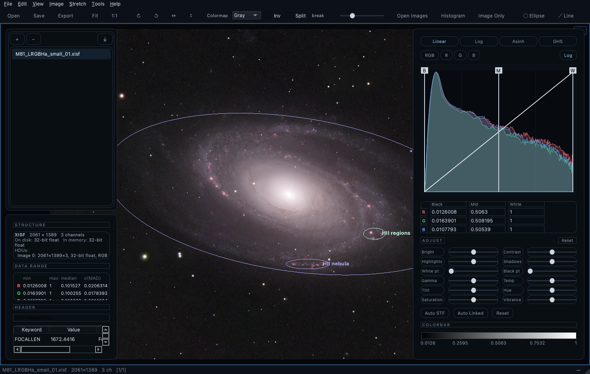

---

## 1. Ouvrir des images

**Formats lus :** FITS (`.fits .fit .fts .fz`, y compris les fichiers
multi-HDU et les images compressées par tuiles ; les données entières sont
mises à l'échelle via BSCALE/BZERO), XISF de PixInsight (`.xisf`, y compris
les propriétés d'image et les solutions astrométriques), et
JPEG / PNG / TIFF / WebP. Tout est promu en flottant 32 bits au chargement :
le pipeline entier suit un seul chemin de code, et les pixels vides NaN/Inf
sont respectés de bout en bout.

Pour ouvrir :
- **Fichier ▸ Ouvrir…** ou le bouton **Ouvrir** de la barre d'outils (la
  sélection multiple fonctionne).
- **Glisser-déposer** sur la fenêtre — ou sur l'icône de l'application
  (macOS ; le bundle déclare les types de fichiers, donc *Ouvrir avec* du
  Finder propose aussi NebulaScope).
- **Fichier ▸ Ouvrir récent** — les 10 dernières images et les 5 derniers
  fichiers d'annotations.
- **Ligne de commande** — voir §13.
- Les **FITS multi-HDU** apparaissent dans la liste d'images comme une
  entrée dépliable, une ligne par HDU image ; cliquez sur le HDU voulu.

Une image nouvellement ouverte s'affiche immédiatement — dans la première
cellule de vue *vide* si la vue est divisée, sinon dans la vue active.
L'ouverture de *plusieurs* images remplit les cellules vides **dans l'ordre
donné** (ligne de commande, sélection du Finder, boîte de dialogue), une
image par cellule, jusqu'à épuisement des cellules. La liste ne contient
chaque image qu'**une seule fois** : rouvrir une image déjà listée
sélectionne sa ligne existante au lieu d'ajouter un doublon (la barre d'état
le signale). À la première visualisation une image reçoit une simple
**rampe linéaire min→max** (prévisible, sans conjecture) ; appuyez sur
**Auto STF** pour un étirement renforcé (§3). Exception : un XISF portant
l'**étirement d'écran enregistré** par l'application productrice
(l'élément `DisplayFunction` — PixInsight y écrit sa STF) s'ouvre avec cet
étirement appliqué : une image traitée dans PI apparaît comme sur l'écran
de PI ; la barre d'état le signale, et **Réinitialiser** revient à la
rampe simple. Un point blanc au-delà du maximum des données (la convention
de PI le place sur le conteneur normalisé [0,1]) est **recalé sur la plage
des données** en forme close — courbe identique sur les données, à un
facteur de luminosité uniforme près — afin que les poignées de
l'histogramme et les champs de valeur restent pleinement utilisables
(dérivation dans l'annexe du chapitre *Transport de couleurs* : la famille
MTF est fermée par restriction-renormalisation). Si la STF enregistrée est
**non liée** (fortement par canal — elle égalise les canaux et annule
visuellement une balance étalonnée comme celle de SPCC), la barre d'état
le signale et suggère **Maj+U**, l'étirement automatique lié qui préserve
l'étalonnage.

**Les images couleur one-shot (OSC) sont dématriçées automatiquement.** Une
image mono dont l'en-tête porte un motif de Bayer (`BAYERPAT`, en honorant
`XBAYROFF`/`YBAYROFF` — écrits par ASIAIR, ASICAP, NINA, SGP, …) s'ouvre en
RVB. **Image ▸ Dématriçage** le contrôle image par image : *Détection
automatique*, un motif forcé (pour les images aux mots-clés absents ou
erronés), ou *Désactivé* pour inspecter la mosaïque brute. L'algorithme est
un choix global — dans le même menu ou dans les Préférences : **RCD** (par
défaut ; directionnel, le meilleur sur les étoiles — validé contre le RCD de
Siril), **Bilinéaire**, ou **Superpixel** (chaque cellule 2×2 devient un
pixel RVB : demi-taille, zéro artefact, le plus rapide). Les changements de
dématriçage (mode de motif ou algorithme) sont **annulables** (⌘Z). Le
dématriçage a lieu au chargement — la barre d'état note la décision (p. ex.
*dématricé RGGB, RCD*), le panneau Infos l'enregistre, et le rechargement
automatique (§7) comme la mémoire d'étirement par image s'y composent
naturellement.

**Mosaïques sans aucune métadonnée** — les outils de capture planétaire et
solaire (FireCapture, SharpCap, …) peuvent déverser la mosaïque brute du
capteur dans un simple PNG ou TIFF en niveaux de gris, où aucun en-tête
n'annoncera jamais de motif de Bayer. NebulaScope renifle les pixels : une
mosaïque se trahit statistiquement (les voisins immédiats diffèrent bien
plus que les voisins de même couleur à deux pixels, et les deux sites verts
s'accordent sur une diagonale de la cellule 2×2). Quand une image mono sans
métadonnées ressemble à une mosaïque non décodée, la barre d'état le
signale et nomme les deux motifs candidats compatibles avec la diagonale
verte détectée — rouge et bleu ne se distinguent pas sans connaître la
scène : choisissez celui qui rend bien (le mauvais jumeau donne un Soleil
bleu). Comme un flux de capture provient d'un seul capteur, **Image ▸
Dématriçage ▸ Appliquer le choix à toute la liste** applique ensuite votre
motif forcé à toutes les images listées en une action (scripts :
`debayer bggr rcd all`).

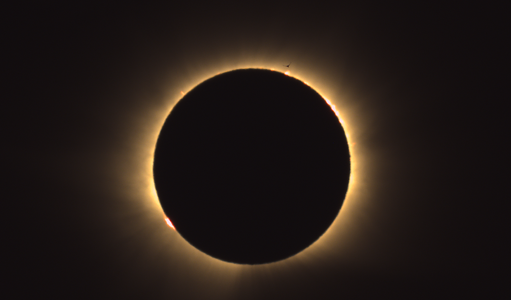

*La session de capture pour laquelle cette fonction est née : l'éclipse
totale de Soleil du 12 août 2026, observée depuis l'Espagne. Les phases
partielles sont arrivées en PNG niveaux de gris sans métadonnées — des
mosaïques BGGR brutes que le renifleur a signalées à l'ouverture — tandis
que la totalité, capturée en FITS avec `BAYERPAT`, s'est décodée
automatiquement. Des protubérances roses bordent le limbe lunaire ;
au-dessus de l'une d'elles, un martinet traverse la couronne interne.*

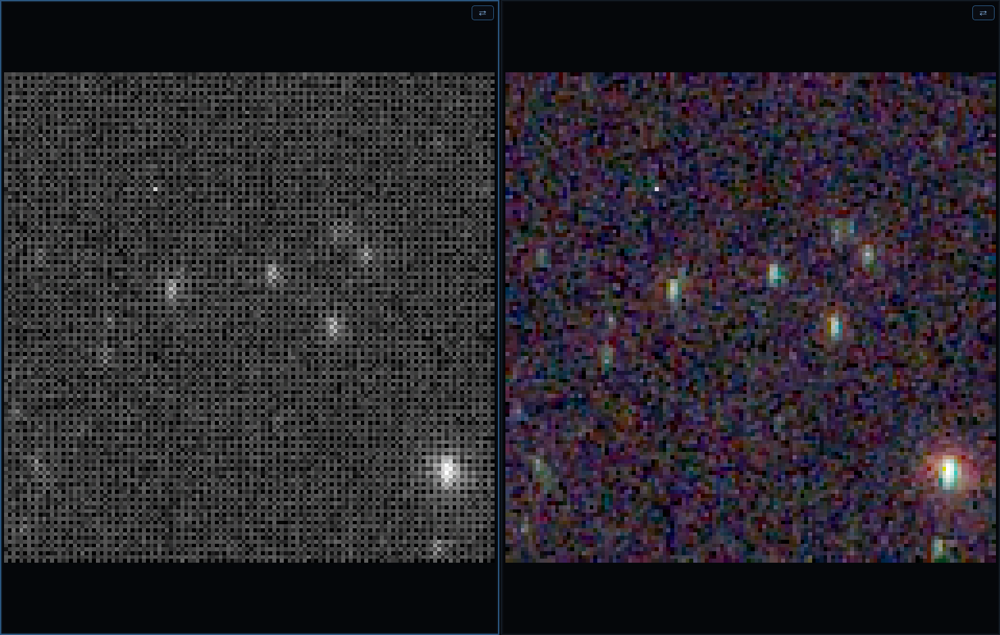

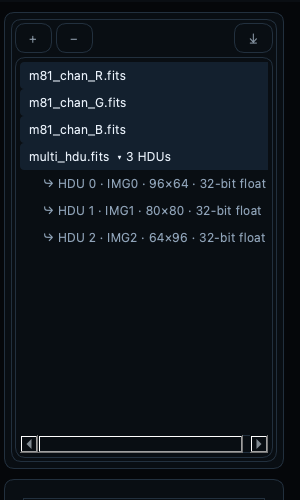

## 2. Le pipeline d'affichage

Les données brutes ne sont jamais modifiées par les opérations d'affichage.
Chaque image traverse :

1. **Fenêtrage** — points noir/blanc par canal à l'intérieur de la plage des
   données.
2. **Fonction de transfert** — Linéaire (avec tons moyens), Log, Asinh ou
   GHS, appliquée en pleine précision flottante sur la fenêtre (les 4096
   échantillons de la LUT et tous les niveaux de sortie couvrent la
   fenêtre — aucune postérisation, si étroite soit-elle).
3. **Ajustements** — contrôles de tonalité et de couleur post-étirement (§4).
4. **Palette de couleurs** (images mono) — table de fausses couleurs.
5. **Conversion 8 bits avec tramage** — supprime les bandes dans les
   dégradés doux.

Le rendu est asynchrone : le déplacement d'un contrôle reste fluide, l'image
rattrape au rythme du rendu (les positions intermédiaires sont sautées,
jamais mises en file).

## 3. Histogramme et contrôle de l'étirement

Le panneau Histogramme (bascule **F3**) est le cœur de l'outil :

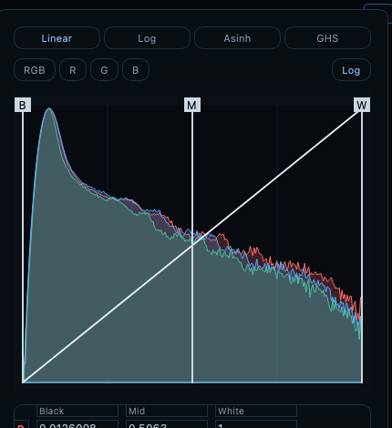

- **Fonctions d'étirement** — onglets **Linéaire / Log / Asinh / GHS**
  (touches : **I** / **L** / **S** / **G**).
  - *Linéaire* joue le rôle du fenêtrage : faites glisser **B** (noir),
    **M** (tons moyens), **W** (blanc) directement sur le tracé. Les images
    RVB affichent en outre les B/M/W propres à chaque canal en fines lignes
    colorées — saisissez-en une **dans le corps du tracé** pour déplacer ce
    canal seul ; les poignées étiquetées de la bande supérieure déplacent
    les trois ensemble.
  - *Log* et *Asinh* se composent avec la fenêtre linéaire ; le tracé zoome
    sur la fenêtre pour que leurs contrôles utilisent toute la largeur.
  - *GHS* (étirement hyperbolique généralisé) : curseurs **D** (intensité)
    et **b** (focalisation locale), plus les poignées déplaçables **SP**
    (point de symétrie — où le contraste se concentre) et **LP/HP**
    (protection des ombres/hautes lumières), tous définis dans la fenêtre
    comme pour les autres modes non linéaires.
- **Canaux** — RVB (liés) ou pastilles individuelles R / V / B.
- **Champs de valeur éditables** — saisie numérique exacte ; les images RVB
  disposent d'une **grille 3×3** complète (R/V/B × noir/médian/blanc) en
  unités des données brutes.
- Le bouton **Axe log** bascule l'échelle logarithmique des fréquences de
  l'histogramme.
- **Auto STF** (**U**) — étirement automatique par canal (fond → ~0,25).
- **Auto STF (lié)** (**Maj+U**) — un étirement partagé issu des
  statistiques regroupées ; préserve la balance des couleurs (à utiliser sur
  des données étalonnées en couleur).
- **Réinitialiser** (**R**) — retour à la fenêtre linéaire simple (efface
  aussi les ajustements).
- **Recharger l'original** (**⌘⇧R**, menu Affichage) — redécodage depuis le
  disque avec les règles de première visualisation (fonction d'affichage
  enregistrée si le fichier en porte une, sinon rampe simple), en oubliant
  la mémoire d'étirement de l'image : exactement comme si NebulaScope
  venait d'être lancé et l'image ouverte.
- **Chaque geste d'étirement ou d'ajustement est annulable** (**⌘Z**) : les
  modifications se regroupent en une étape d'historique par geste, et
  l'historique remonte jusqu'à l'état de chargement — à travers les Auto
  STF, les collages, les ajustements de transport et Recharger l'original
  lui-même.
- **Appliquer à tout** (**Maj+A**) — partage l'étirement courant (+
  ajustements) avec **chaque image de la liste** : chacune l'applique à son
  chargement. Conçu pour les lots d'une même session d'acquisition — réglez
  une image, partagez, puis parcourez le reste en blink. En ligne de
  commande : `--shared-stf` (étire automatiquement la première image et la
  partage) ; dans les scripts : `stfall`. Pour un *sous-ensemble* — ou pour
  un collage **normalisé** qui se recale sur les statistiques propres de
  chaque image — utilisez Copier l'étirement, sélectionnez des images dans
  la liste, puis clic droit ▸ Coller l'étirement.
- La légende **barre de couleurs** montre le transfert courant sur la
  fenêtre, avec des graduations en unités réelles des données ; elle suit la
  palette active *et* les ajustements — ce que montre la barre est
  l'apparence exacte d'un pixel de cette valeur.

**Copier/coller l'étirement** (menu Étirement ; ⌘⌥C / ⌘⌥V) : copie
l'étirement complet. Le collage **Normalisé** recale la fenêtre sur les
statistiques médiane/MAD propres de la cible (le bon choix pour comparer des
expositions ou filtres différents) ; **Absolu** transporte la fenêtre exacte
en unités des données.

**Mémoire d'étirement par image** — chaque image se souvient de son dernier
étirement (et de ses ajustements) et les réapplique quand vous y revenez.

## 4. Ajustements (post-étirement)

La section **AJUSTER** se trouve sous les contrôles d'étirement — toujours
visible, dans chaque mode, avec son propre **Réinitialiser** (l'étirement
n'est pas touché). Les douze curseurs s'appliquent aux valeurs d'affichage
étirées, et se composent donc à l'identique avec Linéaire/Log/Asinh/GHS :

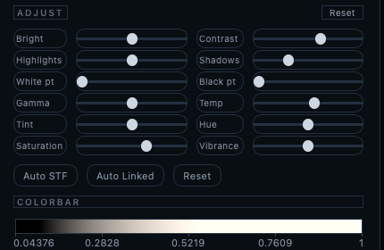

| Colonne gauche | Colonne droite |
|---|---|
| Luminosité | Contraste |
| Hautes lumières | Ombres |
| Point blanc | Point noir |
| Gamma | Température |
| Teinte (tint) | Teinte (hue) |
| Saturation | Vibrance |

- **Tonalité** (Luminosité…Gamma) : courbes par canal, épinglées aux
  extrémités noir/blanc quand c'est pertinent ; reflétées en direct dans la
  courbe de transfert.
- **Couleur** (Température…Vibrance) : images RVB uniquement. La
  **Vibrance** est une saturation pondérée vers les pixels peu saturés —
  elle avive les nébulosités sans écrêter la couleur des étoiles.
- **Cliquez sur un curseur, puis utilisez la molette** pour des pas fins (le
  survol seul ne modifie jamais rien).
- Les ajustements sont **par image** — réinitialisés à la première visite,
  mémorisés par image dans la session, et **persistés dans le fichier annexe
  d'annotations** (§9) ; un fichier annexe portant des ajustements les
  restaure à la première visualisation de la session suivante.

## 5. Palettes de couleurs (images mono)

Gris, Chaleur, Viridis, Magma, Inferno, Cividis — plus les **palettes
classiques de SAOImage DS9** (a, b, bb, he, cool, rainbow, standard, et
les palettes à paliers i8, aips0 et sls), reproduites depuis les points de
contrôle de référence de DS9 : le rendu est identique à DS9. Toutes se
choisissent dans la barre d'outils ; scripts : `cmap <nom>`. Deux
**modificateurs** composables fonctionnent avec *toutes* les palettes :

- **inv()** — inversion complète.
- **split(t)** — sous le seuil *t* la palette est inversée, au-dessus elle
  est normale ; excellent pour percevoir les structures ténues du fond.
  Seuil réglable.

Les images RVB ignorent la palette (le sélecteur est désactivé).

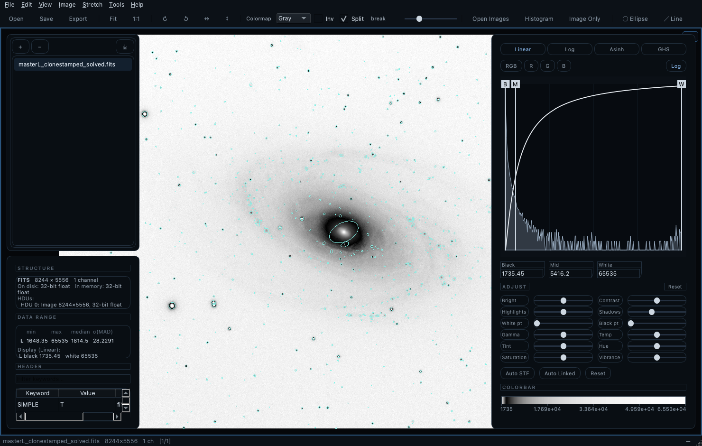

## 6. Inspection

À la souris (dans toute vue) :
- **Glisser gauche** — zoom élastique sur la région tracée.
- **Molette** — zoom au curseur (**Maj+molette** = pas 5× plus fins).
- **Glisser droit / molette / Maj+gauche** — panoramique.
- **Clic droit** — menu contextuel (§10).
- **Survol** — la barre d'état affiche (x, y), les valeurs brutes par canal,
  et AD/Déc quand une solution astrométrique existe.

Commandes de zoom : **Ajuster à la vue** et **1:1** (touche **1**) dans le
menu Affichage et la barre d'outils — et le zoom clavier pour travailler
sans souris : **>** / **<** par pas de 10 %, **.** / **,** par pas de 3 %
(les deux pourcentages sont réglables dans les Préférences), centrés sur la
vue. Quand la vue image a le focus, les **flèches font un panoramique** ;
quand la liste d'images a le focus, ↑/↓ parcourent la liste (le blink
lui-même reste sur **Espace**/**Maj+Espace**).

Le **panneau Infos** (**P** ou F4) montre les dimensions, le format des
pixels, min / max / médiane / MAD par canal, la structure des HDU FITS, et
l'en-tête complet (cartes FITS ou propriétés XISF) dans un tableau filtrable
et copiable.

## 7. Sessions, blink et liste d'images

- **Espace** / **Maj+Espace** — image suivante / précédente, en boucle. Le
  zoom et le panoramique sont conservés entre images de même taille : on
  peut donc faire clignoter une petite région.
- **Maj+L** (ou **F2**) bascule la liste d'images ; **C** ferme les images
  surlignées (seulement la courante si rien d'autre n'est sélectionné ;
  fermer la dernière vide toutes les vues). Fermer une image libère tout ce
  que l'application détient pour elle — pixels décodés, copies par vue,
  mémoire d'étirement — une longue session de tri n'accumule donc pas de
  RAM. Si une image en cours de fermeture a des annotations non
  enregistrées, une seule invite couvre tout le lot : **Enregistrer les
  annotations** écrit le fichier annexe par défaut de chaque image
  concernée (en l'écrasant), **Ignorer et fermer** abandonne les
  modifications, **Annuler** interrompt la fermeture pour traiter les
  images une à une.
- Gestion de la liste : **+** ajoute, **−** / menu contextuel **Fermer et
  retirer de la liste** (même fermeture-libération que **C**),
  glisser pour réordonner, export (**⤓**) et **Fichier ▸ Importer une liste
  d'images…** recharge une liste sauvegardée (un chemin par ligne,
  commentaires `#`, chemins relatifs résolus par rapport au fichier de
  liste). `--list` fait de même en ligne de commande. **Vider la liste et
  tout fermer** (**⌥C**, menu Affichage ou menu contextuel de la liste)
  vide la liste et toutes les vues d'un seul geste.
- Les résultats en mémoire (combinaison, transport, recadrage) sont marqués
  dans la liste ; **Enregistrer les données sous…** — ou **Enregistrer
  l'image étirée sous…** — transforme l'entrée en fichier sauvegardé (nom,
  fichiers annexes et état par image suivent, et le rechargement
  automatique se met à surveiller le fichier).
- **Tri par blink (culling)** — chaque ligne de la liste porte une **coche
  de conservation** (cochée par défaut). Parcourez une session en blink avec
  **Espace**/**↓** et appuyez sur **B** pour rejeter la mauvaise image sous
  vos yeux — le dématriçage et l'édition STF en direct restent disponibles
  en permanence, ce qui distingue précisément ce blink des autres. **B** et
  les coches tiennent compte de la sélection : surlignez plusieurs lignes
  et **B** les bascule en groupe (toutes cochées ; il ne décoche que
  lorsque toutes le sont déjà), et cliquer une coche dans une sélection
  multiple re-coche toute la sélection — un clic sur une ligne non
  sélectionnée reste individuel. Agissez
  ensuite sur les coches depuis le menu clic droit de la liste :
  **Cocher/Décocher la sélection**, **Trier : cochées d'abord**, **Déplacer
  les cochées/décochées vers…** (les fichiers partent avec leurs annexes
  d'annotations, et la liste les suit à leur nouvel emplacement), et
  **Retirer les cochées/décochées de la liste**. Scriptable via `tag`,
  `tagsort`, `tagremove`, `tagmove` (§13) pour des chaînes de tri
  automatisées.
- **Rechargement automatique** (Affichage ▸ Recharger les fichiers
  modifiés, actif par défaut) : quand un autre programme — PixInsight,
  Siril, GraXpert, … — écrase un fichier listé sur le disque, NebulaScope le
  redécode automatiquement (dans chaque vue qui l'affiche, active ou non).
  La mémoire d'étirement s'applique aux données rechargées, et zoom et
  panoramique survivent si les dimensions n'ont pas changé. Gardez
  NebulaScope ouvert à côté de votre suite de traitement : chaque
  sauvegarde apparaît dès qu'elle touche le disque.

## 8. Géométrie : rotation et miroir

Menu Image / barre d'outils :
- **Rotation 90° horaire / antihoraire** ( `]` / `[` ) et **Miroir
  horizontal / vertical** (⌘H / ⌘J) — sans perte, exacts.
- **Rotation d'un angle…** (⌘R) — la boîte de rotation : un **cadran
  d'angle** manipulable (Maj = fin, molette = ±1°, double-clic = 0°), un
  champ de précision, et un aperçu en direct. **Appliquer** tourne sans
  fermer (pour tâtonner). L'angle est *absolu* : toute nouvelle rotation
  rééchantillonne **une seule fois** depuis les données d'origine — essayer
  de nombreux angles ne dégrade jamais l'image. Rééchantillonnage
  bilinéaire ; les coins découverts deviennent vides (NaN).
- **⬆ Nord en haut** (dans la boîte, si l'image est résolue) — un clic règle
  l'angle qui met le nord céleste en haut / la ligne de Déc centrale à
  l'horizontale.

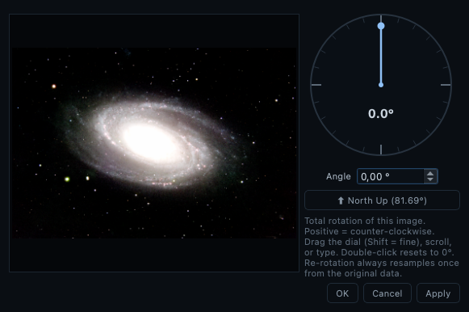

Tout suit les pixels à travers chaque transformation : les annotations, la
solution astrométrique (pixel de référence + matrice CD) et les
calibrations de liaison de vues. Les historiques d'orientation sont
**normalisés** — revenir en arrière restaure toujours exactement le canevas
d'origine (les bordures d'expansion ne s'accumulent jamais). L'orientation
est enregistrée par image (et dans les fichiers annexes) : une image se
rouvre comme vous l'aviez laissée. Note : après une rotation *arbitraire*,
**Enregistrer les données sous** écrit des pixels rééchantillonnés — faites
la photométrie sur des données non tournées.

**Recadrer sur la région visible** (**Maj+C**, menu Image ; scripts :
`crop x y w h` ou `crop view`) : cadrez la région en zoomant — exactement
comme pour une capture d'écran — et recadrez-la dans une NOUVELLE entrée de
liste en mémoire, en **pleine profondeur de bits** ; l'original est
intouché. *La solution astrométrique survit exactement* : un recadrage ne
fait que translater le pixel de référence (CRPIX), et la solution recalée
est écrite dans l'en-tête du recadrage en cartes FITS standard — même quand
la source ne la portait qu'en propriétés XISF de PixInsight. Les
annotations se translatent avec les pixels, l'étirement courant est
conservé, et **Enregistrer les données sous…** écrit le résultat en
FITS/XISF/TIFF 16 bits. Annulable comme tout résultat synthétique.

## 9. Annotations

Un pur **calque vectoriel** — jamais rastérisé dans les données.

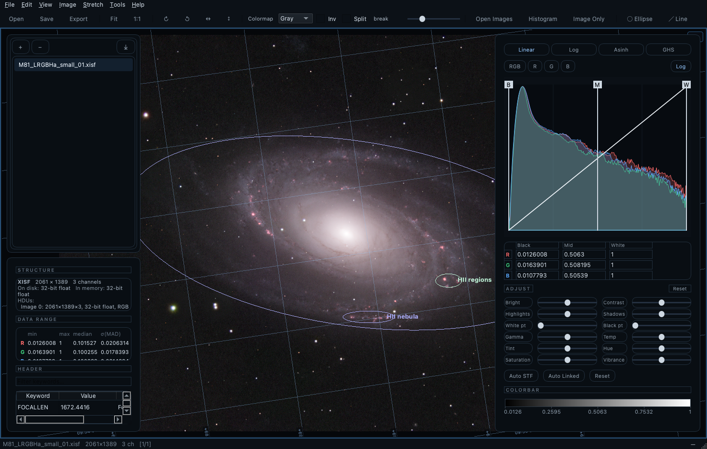

- **Dessiner** — outils de la barre : ellipse (glisser), segment (glisser ;
  l'étiquette se place au-delà du point de départ, sans jamais croiser le
  segment), texte (clic).
- **Éditer** — clic pour sélectionner (poignées : redimensionnement
  d'axe/extrémité, glisser le corps pour déplacer), **double-clic** pour
  éditer texte et couleur, **Suppr** pour retirer, **⌘⇧C / ⌘⇧V** copier /
  coller-au-curseur, **annuler/rétablir** complet.
- **Enregistrer les annotations** est disponible dès qu'il existe un état
  digne d'un fichier annexe — des formes, un historique de
  rotation/miroir, ou des ajustements non neutres — une simple orientation
  peut donc être persistée et restaurée à la session suivante.
- **Afficher/masquer** — touche **A** (la grille est séparée). Charger ou
  importer des annotations les rend toujours visibles.
- **Inverser le contraste** — menu clic droit, pour les champs brillants.
- **Persistance** — fichiers annexes JSON (`<image>_annotation.json`),
  chargés automatiquement à l'ouverture (réglable dans les Préférences).
  *Enregistrer* écrase sans demander ; *Enregistrer sous…* demande. Les
  annexes portent aussi l'**orientation** de l'image et les **ajustements**
  d'affichage (§4) ; l'enregistrement fonctionne avec des ajustements seuls
  (aucune forme requise). Les annotations non sauvegardées avertissent à la
  fermeture.
- **Import SExtractor** — Outils ▸ Importer un catalogue SExtractor… lit
  les catalogues ASCII (requiert `X_IMAGE`/`Y_IMAGE` ; utilise les ellipses
  `A/B/THETA_IMAGE` si présentes), avec facteur d'échelle des ellipses,
  filtrage par `FLAGS`, coloration par `CLASS_STAR`, et étiquettes
  `NUMBER`/`MAG_AUTO`. Les détections se projettent correctement sur les
  vues tournées.

## 10. Astrométrie

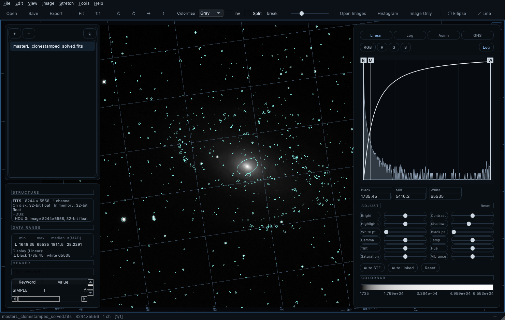

Les solutions sont lues depuis les mots-clés WCS FITS (TAN) et depuis les
propriétés XISF `PCL:AstrometricSolution` de PixInsight ; les images non
résolues se rabattent sur les mots-clés de pointage du télescope pour des
coordonnées approchées.

- Lecture au survol : AD/Déc du pixel sous le curseur.
- **Grille AD/Déc** (**Maj+G**) avec libellés de coordonnées alignés sur les
  axes (densité réglée dans les Préférences).
- **Menu clic droit**, groupé lecture / annotations / consultation / zoom :
  copier AD/Déc, copier la valeur du pixel, annoter ici, coller
  l'annotation, **Consulter dans Aladin** (ouvre Aladin Lite cadré à ~10×
  l'annotation cliquée), **Identifier dans SIMBAD** (recherche par cône à
  l'échelle de l'annotation), et **Pointer Stellarium ici** — pilote un
  Stellarium en cours d'exécution (son greffon *Remote Control* activé,
  port 8090 par défaut) vers la position céleste cliquée avec un champ
  correspondant : là où Aladin répond *qu'est-ce que c'est*, Stellarium
  répond *où est-ce dans le ciel de ce soir depuis mon site*.

## 11. Combiner des images

### Combiner les canaux (Outils ▸ Combiner les canaux…)

Fusionne jusqu'à **7 entrées mono** — R, V, B, S(II), H(α), O(III), L — en
une image couleur via une matrice de combinaison linéaire :

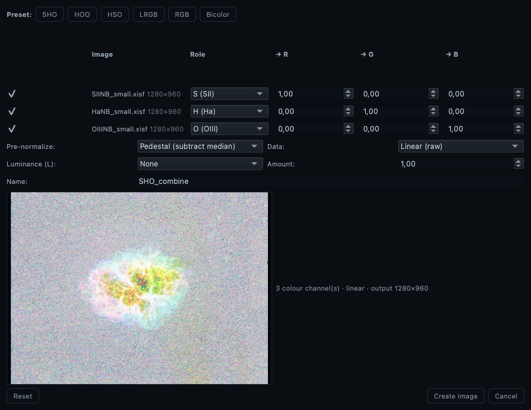

*La boîte avec trois masters à bande étroite (M1) affectés S/H/O et
l'aperçu en direct.*

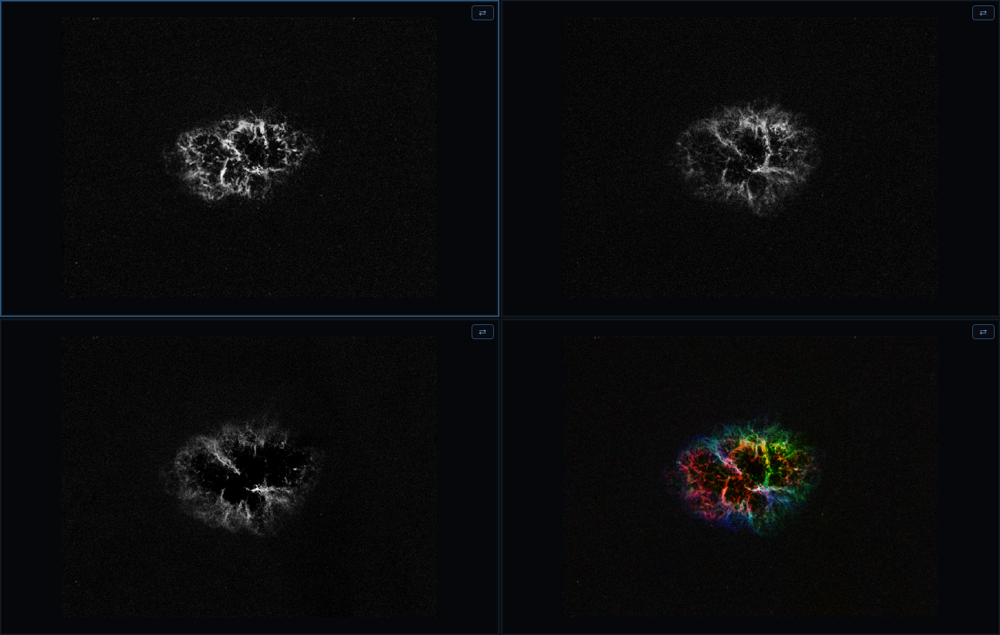

*L'image créée arrive dans la première vue vide : chaque canal à côté du
résultat en palette Hubble.*

- **Préréglages de palette** : SHO/Hubble, HOO, HSO, LRVB, RVB simple,
  bicolore.
- **Prénormalisation** par canal : médiane / piédestal de fond / min-max /
  aucune / **Tel qu'affiché** — cette dernière fusionne chaque canal *à
  travers son étirement de vue courant* : ce que vous voyez est exactement
  ce qui se combine.
- Les deux **modes de luminance** (transfert de clarté propre ou addition
  linéaire).
- Les entrées doivent partager les dimensions (erreur claire sinon).
- Grand **aperçu en direct** réagissant aux poids ; bascule par canal.
- La boîte **mémorise ses réglages** ; **Réinitialiser** restaure les
  défauts.
- Le résultat arrive dans la première vue vide (ou la vue active), nommé
  d'après la palette ; enregistrez-le avec **Fichier ▸ Enregistrer les
  données sous…**.

### Combiner les étoiles (Outils ▸ Combiner les étoiles (screen)…)

Recompose une image **sans étoiles** avec une image **étoiles seules** par
fusion *screen* `1 − (1−sansétoiles)(1−k·étoiles)` — quasi additive dans
les zones sombres, sûre vis-à-vis de la saturation dans les claires :

- Les deux images en RVB (ou les deux en mono), mêmes dimensions ; choisies
  dans la liste (devinées d'après les noms contenant « starless »/« star »).
- Curseur **quantité d'étoiles** (0–150 %) qui met les étoiles à l'échelle
  avant la fusion.
- Opère sur le rendu **tel qu'affiché** de chaque image ; aperçu en direct ;
  appariement mémorisé.

### Transport de couleurs (Outils ▸ Transporter les couleurs d'une référence…)

Recolore l'image courante pour épouser la distribution de couleurs d'une
référence (transport optimal par tranches sur les valeurs affichées) :

- Les distributions sont estimées **uniquement sur les pixels visibles dans
  chaque vue** — zoomez d'abord les deux vues sur l'objet ; le champ hors
  écran n'influence jamais le résultat. Les pixels saturés sont exclus (les
  cœurs d'étoiles ne peuvent ni ne doivent être appariés).
- Fonctionne entre modalités (p. ex. emprunter la palette d'un rendu RVB
  pour une image SHO). Les images tournées sont traitées dans le référentiel
  du disque — aucune bordure n'est incrustée. Le résultat est une nouvelle
  entrée de liste prête à l'affichage ; annulable.

**Appliquer comme ajustement d'étirement** (case de la boîte ; scripts :
`transport <ligne> [force] stretch [colour]` ; une seconde case *Ajuster
aussi les réglages de couleur* ajoute une étape inter-canaux —
température/teinte/rotation de teinte/saturation — pour les
correspondances exigeant une rotation de teinte ; théorie complète dans le
chapitre *Transport de couleurs*) : au lieu d'écrire de nouveaux pixels,
NebulaScope ajuste les points noir/médian/blanc de chaque canal pour que
l'*affichage* épouse les couleurs transportées — totalement non destructif :
rien ne peut postériser, et le bruit n'est jamais amplifié par
l'application. La correspondance est proche plutôt qu'exacte (les rotations
inter-canaux échappent à la famille des étirements par canal) ; la barre
d'état rapporte l'erreur RMS d'ajustement par canal pour en juger. Le mode
exact, qui écrit les pixels, reste disponible quand la fidélité prime sur
la pureté des données.

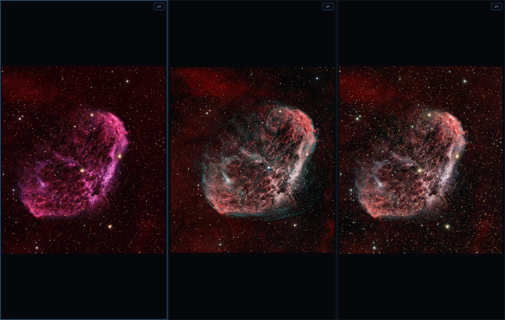

## 12. Vues divisées et navigation liée

**Affichage ▸ Diviser la vue…** — une boîte avec compteurs lignes ×
colonnes (max 5×5).

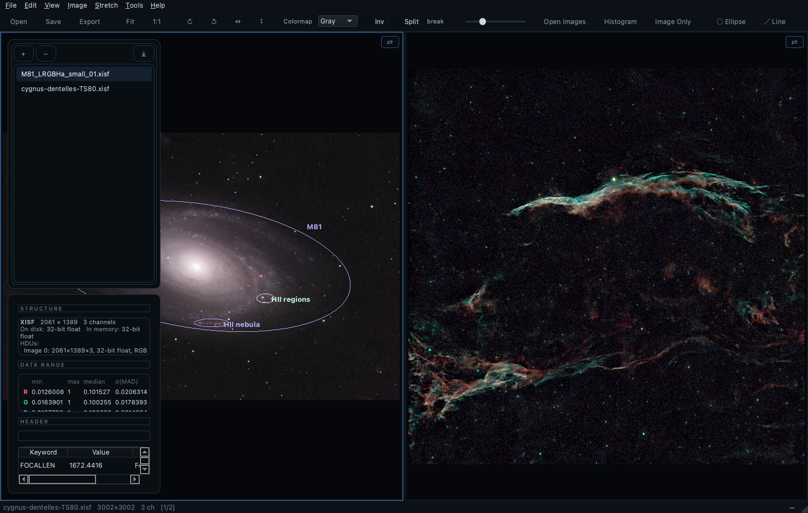

- Une cellule est **active** (bordure bleue) — l'histogramme, le panneau
  Infos, les outils et la rotation agissent sur elle. Cliquez une cellule
  pour l'activer ; puis cliquez une entrée de liste pour l'y charger — ou
  **glissez-déposez simplement une entrée de la liste sur une cellule** :
  la cellule s'active et affiche cette image (la ligne reste dans la
  liste ; glisser *au sein* de la liste réordonne toujours).
  Chaque cellule garde sa propre image décodée : les comparaisons ne
  redécodent pas (contrairement au blink de gros fichiers).
- **Liaison automatique** — les cellules dont les images ont des dimensions
  identiques partagent zoom/panoramique. Le bouton **⇄** de chaque cellule
  permet de s'en retirer.
- **Liaison calibrée** (tailles différentes) — alignez les deux vues à la
  main (zoom/panoramique/rotation jusqu'à faire coïncider les détails),
  puis cochez **⇄** sur la seconde image : la correspondance courante
  devient la calibration, et les vues naviguent désormais ensemble, chacune
  à sa propre échelle de pixels. Les calibrations survivent aux rotations
  et miroirs de chaque image.
- `--split RxC` règle la grille depuis la ligne de commande (§13).

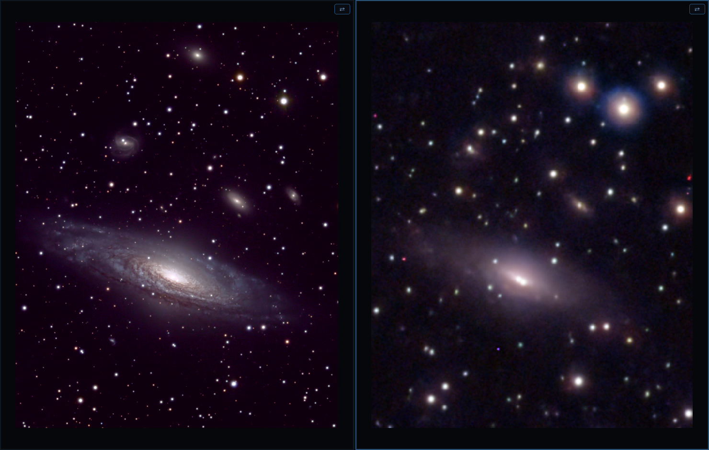

*Ce pourquoi les vues liées existent : la même supernova saisie par deux
instruments — un C11 et un téléobjectif de 64 mm d'ouverture — comparées
côte à côte, chacune à sa propre échelle de pixels. Avec la liaison
calibrée (⇄) engagée, panoramique et zoom interrogent les deux optiques à
la même position du ciel.*

## 13. Ligne de commande

L'interface en ligne de commande et le langage de script restent en anglais
(c'est une API stable, indépendante de la langue de l'interface — les
scripts `.nsc` d'un utilisateur anglophone tournent à l'identique sur une
machine française). Référence complète : `nebulascope --run list` et
`nebulascope --help <commande>` ; voir aussi le §13 de l'édition anglaise
de ce manuel et `tests/smoke.nsc` pour un exemple complet.

```
nebulascope [options] [fichiers...]

  -l, --list <fichier>   Charge une liste d'images sauvegardée.
      --split <LxC>      Divise la vue (max 5x5).
      --shared-stf       Étire la première image et partage cet étirement.
      --lang <code>      Force la langue de l'interface (en, fr, system).
      --run <script>     Exécute un script de commandes (tests/batch).
      --run list         Liste toutes les commandes de script.
  -h, --help [commande]  Aide — générale, ou détaillée pour une commande.
```

Exemples : `nebulascope *.fits` · `nebulascope --list cette-nuit.txt` ·
`nebulascope --split 1x2 lum.fits ha.fits`.
(macOS : invoquez le binaire à l'intérieur du bundle, ou créez un lien
symbolique vers votre PATH — voir docs/BUILDING-macos.md.)

## 14. Export

Dans chaque boîte d'enregistrement, **cliquez sur n'importe quel nom
d'image existant pour adopter son nom de base** — fichiers FITS, XISF ou
images ordinaires ; l'extension vient toujours du format sélectionné.
Cliquer `M81.xisf` dans un export PNG préremplit `M81`, enregistré
`M81.png` ; avec le format correspondant sélectionné, le nom d'origine se
reconstitue à l'identique, pour écraser ou réenregistrer.

- **Fichier ▸ Enregistrer les données sous…** — les *données* (Float32,
  orientation courante) : FITS, XISF, ou TIFF 16 bits. Enregistrer un
  résultat en mémoire renomme son entrée de liste en fichier.
  **Interopérabilité XISF :** les flottants sont normalisés dans [0,1] (la
  convention de PixInsight ; les mots-clés `NSSCALE`/`NSZERO` consignent la
  plage d'origine). L'enregistrement **FITS** préserve soigneusement les
  métadonnées : les valeurs gardent leur type naturel (les nombres restent
  numériques, pas des chaînes), et quand un XISF natif PixInsight ne porte
  ses métadonnées qu'en *propriétés* XISF, les mots-clés standard
  (DATE-OBS, EXPTIME, FOCALLEN, XPIXSZ, RA/DEC, INSTRUME, …) sont
  synthétisés à partir d'elles — unités converties là où les conventions
  diffèrent. Le choix de **compression** XISF — Zstd (la plus compacte ;
  retombe silencieusement sur Zlib si votre libXISF ne la gère pas), Zlib
  (compatibilité maximale), ou Non compressé — se fait **dans la boîte
  d'enregistrement elle-même** (activé quand le format XISF est
  sélectionné) ; les blocs sont mélangés par octets (*byte-shuffling*)
  pour de meilleurs taux, et le choix est mémorisé pour la session.
- **Fichier ▸ Enregistrer l'image étirée sous…** — grave le transfert
  d'affichage courant (étirement + ajustements) en FITS/XISF/TIFF Float32.
  Même choix de compression XISF.
- **Fichier ▸ Exporter la vue sous…** (⌘E) — l'image *affichée* (étirée,
  avec palette) : PNG / JPEG / TIFF / WebP. Les options de format sont
  **dans la boîte d'export elle-même** — aucune fenêtre supplémentaire :
  profondeur **8 ou 16 bits** pour PNG/TIFF (le 16 bits est construit
  depuis le rendu flottant — dégradés sans bandes), **qualité** pour
  JPEG/WebP ; chacune s'active avec le format correspondant.
- **Fichier ▸ Exporter la région zoomée sous…** (⌘⇧E) — idem, mais
  seulement la région visible.
- **Fichier ▸ Exporter / Importer une liste d'images…** — aller-retour de
  session (§7).
- Annotations et ajustements s'exportent via leurs fichiers annexes JSON
  (§9).

## 15. Disposition, préférences et personnalisation

- **Disposition en surimpression** (par défaut) : la liste
  d'images/panneau Infos et l'histogramme flottent en translucidité sur le
  canevas. **O** bascule vers la disposition classique en panneaux ancrés
  et retour. L'opacité des panneaux est une préférence — 100 % (opaque) est
  le plus rapide.
- **Tab** — mode image seule (tous les panneaux masqués ; Échap sort). Le
  **plein écran** a son propre raccourci ; **⌥F** est le bouton vert au
  clavier : plein écran natif aller-retour sous macOS (barre de menus
  masquée, Espace dédié ; sous Linux/Windows, agrandit/restaure). **H**
  masque les barres de défilement **et tout l'habillage des vues** —
  bordure de cellule active et boutons de liaison — pour un canevas
  entièrement épuré (les panoramiques fonctionnent toujours), p. ex.
  pour prévisualiser un fond d'écran en plein écran.
- **Préférences…** (menu de l'application sur macOS) :
  - **Général** — langue de l'interface (système / English / Français) ;
    couleur, taille de texte et épaisseur de trait par défaut des
    annotations ; densité de la grille AD/Déc ; chargement automatique des
    fichiers annexes ; opacité des panneaux en surimpression ; tailles des
    listes de fichiers récents.
  - **Raccourcis** — le raccourci de chaque action, éditable ; stocké dans
    `shortcuts.ini` (valeur vide = désactivé ; les conflits obsolètes sont
    rétablis).
- **À propos** — la version et le copyright viennent de
  `src/app/AppInfo.h` (maintenu à la main), suivis de l'**identifiant de
  compilation** exact (`git describe`, p. ex. `v0.92-3-ga6a8118`,
  `-dirty` si compilé avec des changements non commités) — un binaire de
  test dit ainsi toujours de quel commit il provient. Aussi en ligne de
  commande : `--version`.

## 16. Dépannage

- *« No 2-D image in primary HDU »* — l'image vit dans une extension ;
  choisissez le HDU dans l'entrée de la liste d'images.
- *Vue délavée ou noire* — Réinitialiser, puis Auto STF ; vérifiez que les
  poignées de fenêtre ne sont pas repliées l'une sur l'autre.
- *Curseurs d'ajustement inertes* — les curseurs couleur
  (Température…Vibrance) sont désactivés pour les images mono ; les
  curseurs de tonalité fonctionnent partout.
- *Une image étalonnée en couleur (SPCC/PCC) paraît non étalonnée* —
  l'**Auto STF** par canal (U) égalise les canaux et annule à l'écran la
  balance de l'étalonnage. Utilisez **Auto STF (lié)** (Maj+U), qui la
  préserve — ou enregistrez depuis PI avec sa STF active : la fonction
  d'affichage enregistrée est appliquée à l'ouverture.
- *Un XISF de NebulaScope ressemble à du bruit dans PixInsight* — corrigé
  en v0.84+ (flottants normalisés dans [0,1]) ; réenregistrez le fichier.
  Les blocs compressés (v0.86+) sont vérifiés sous PI et hors de cause.
- *AD/Déc absents sur un XISF* — vérifiez que le fichier porte des
  propriétés `PCL:AstrometricSolution:*` (filtre du panneau Infos :
  `Astrometric`).
- *Annotations déplacées après import* — elles se projettent via
  l'orientation enregistrée ; si le fichier annexe précède la v0.12,
  réorientez et réenregistrez une fois.
- *Zoom/panoramique lents avec les panneaux en surimpression* — passez
  l'opacité à 100 % dans les Préférences (la translucidité coûte des
  repeints).
- Problèmes de compilation — voir `docs/BUILDING-{macos,linux,windows}.md`
  (en anglais).
